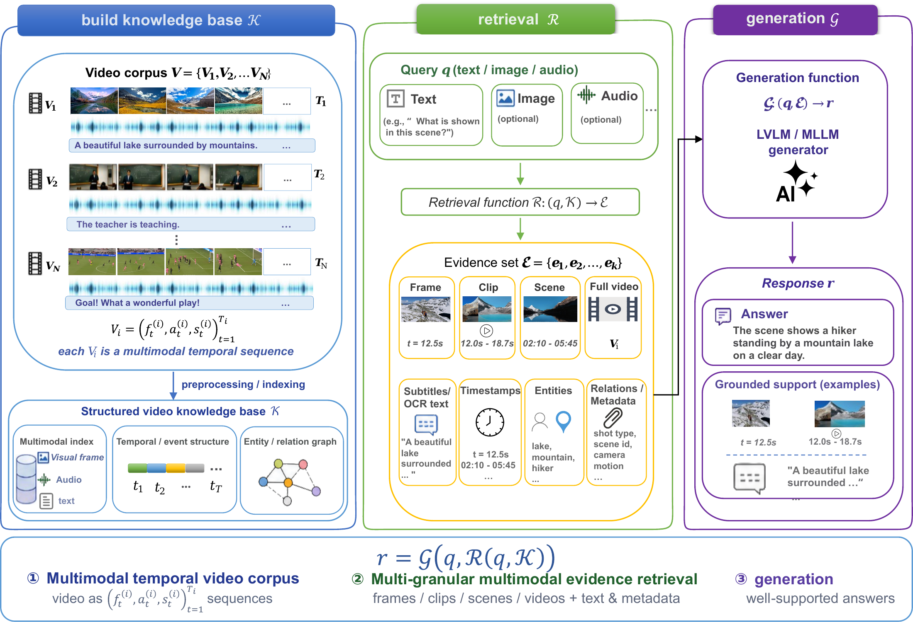
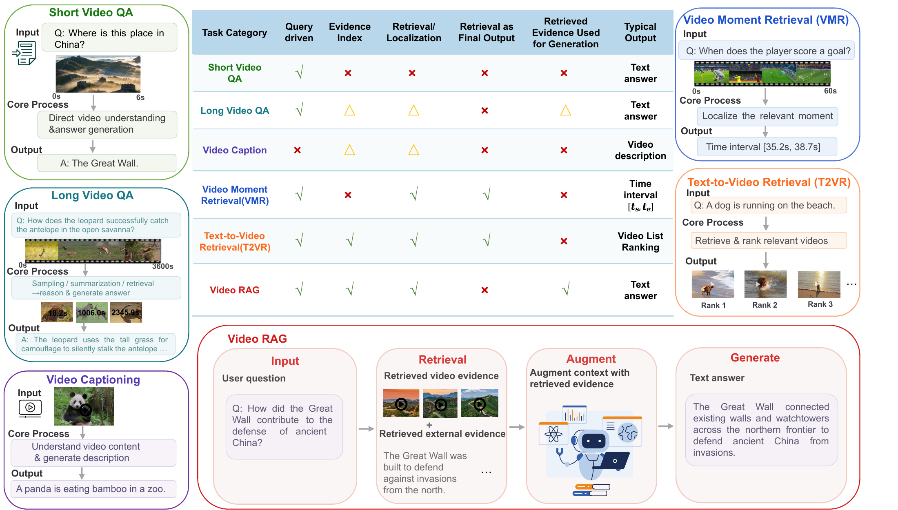
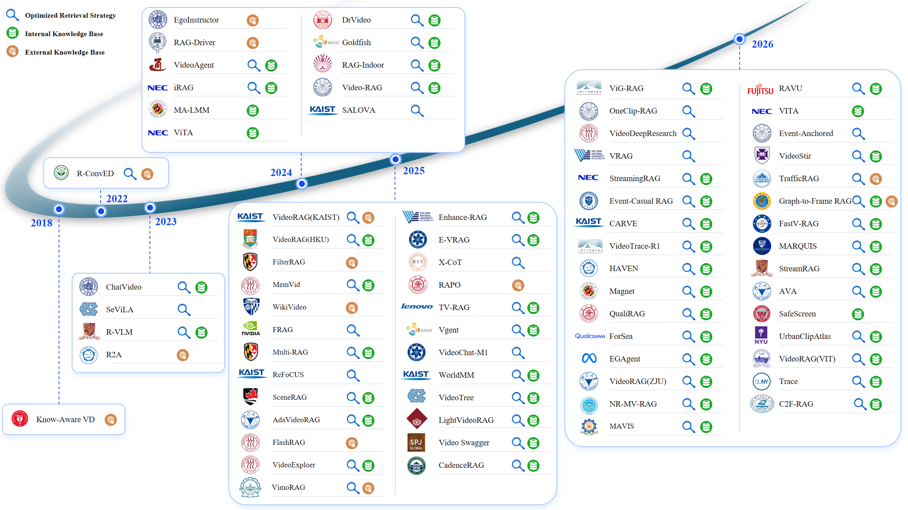
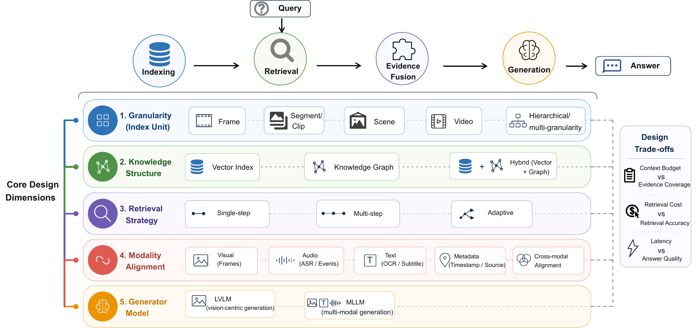
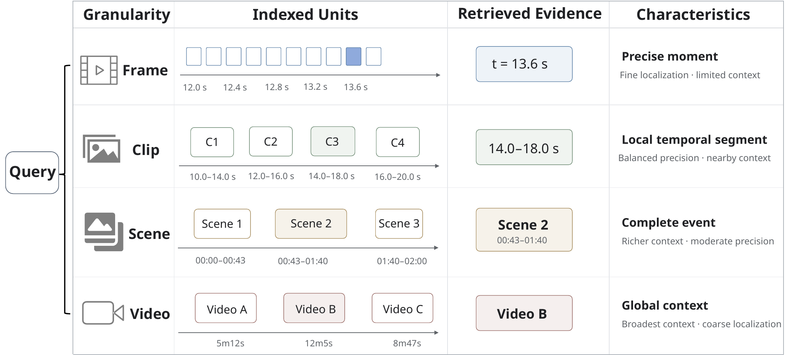
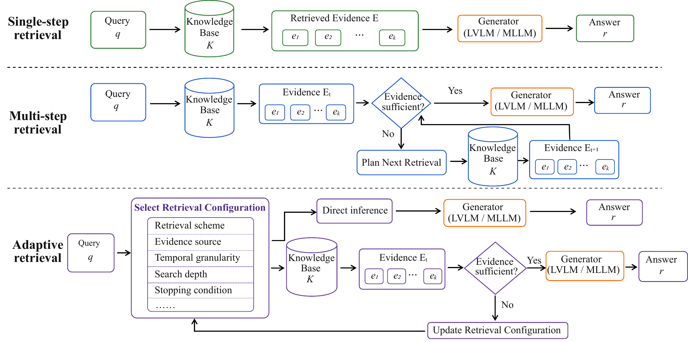
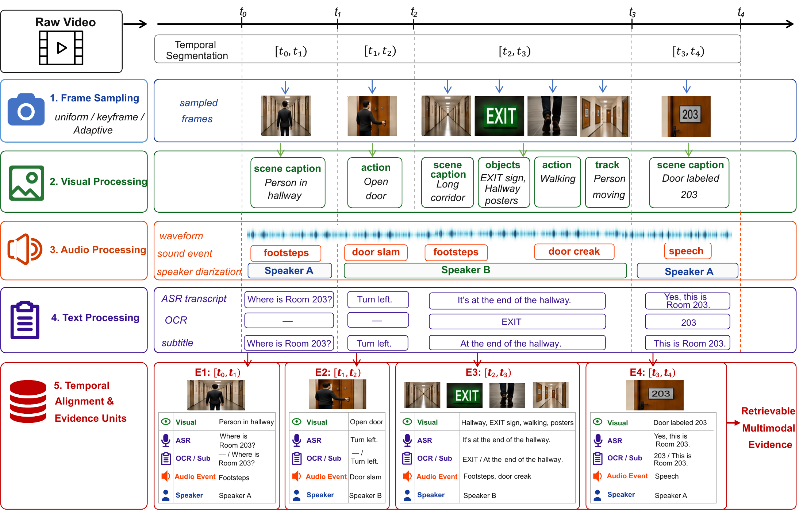
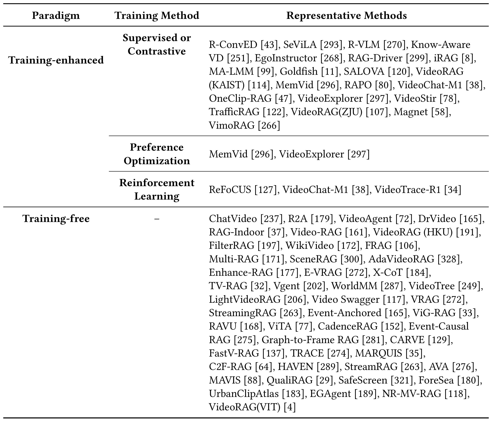
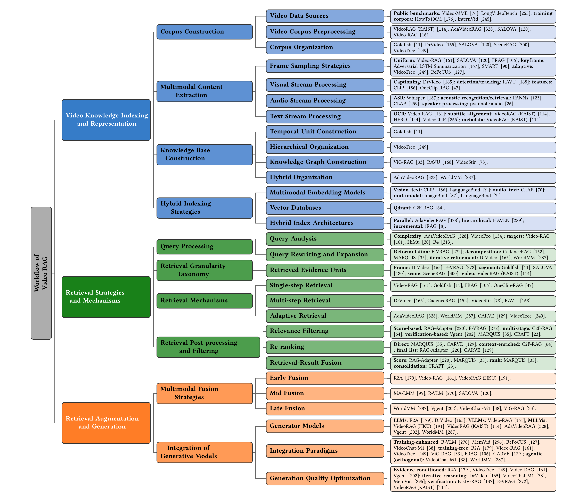
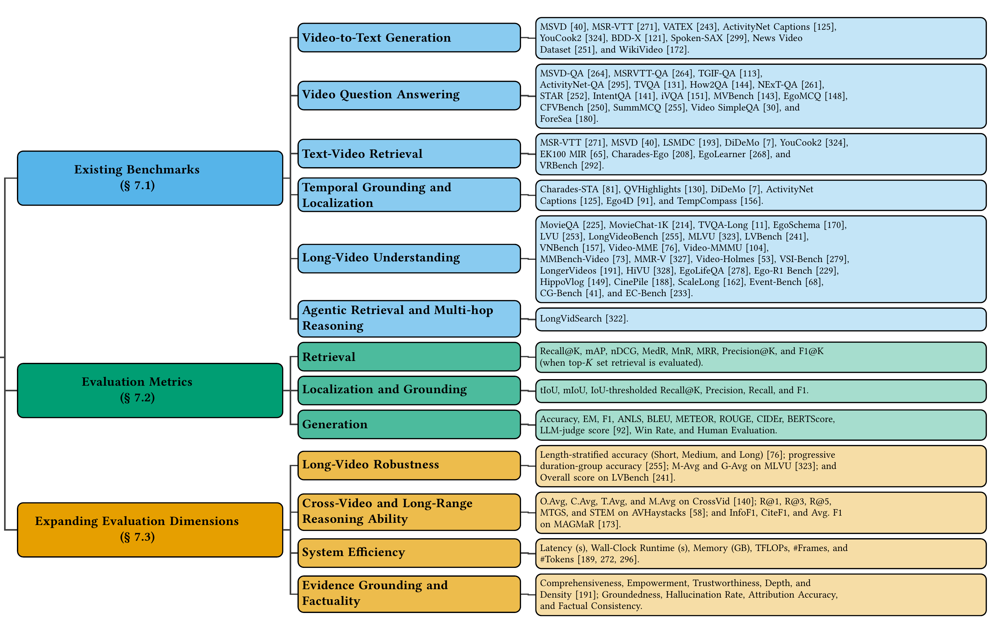

<h1 align="center">Awesome Video RAG</h1>

<p align="center">
  <strong>Paper list and project page for <em>A Comprehensive Survey on Video Retrieval-Augmented Generation</em></strong>
</p>

<p align="center">
  
  
  
  
</p>

This repository accompanies the survey:

> **A Comprehensive Survey on Video Retrieval-Augmented Generation**  
> Working manuscript. The public paper link and final bibliographic metadata will be added after release.

Video Retrieval-Augmented Generation (Video RAG) builds searchable multimodal knowledge from videos, retrieves evidence for a query, and uses that evidence to generate an answer. Evidence may be visual, textual, acoustic, temporal, or structured.

The survey studies Video RAG as a three-stage pipeline:

- **Video knowledge indexing and representation**: corpus construction, multimodal extraction, temporal alignment, knowledge-base construction, and hybrid indexing.
- **Retrieval strategies and mechanisms**: query processing, multi-granular retrieval, single-step/multi-step/adaptive retrieval, and post-retrieval filtering.
- **Retrieval augmentation and generation**: multimodal evidence fusion, generator integration, training strategies, and grounded response generation.


---

<a id="quick-index"></a>

## Quick Index

- [What Counts as Video RAG?](#what-counts-as-video-rag)
- [Evolution](#evolution)
- [Taxonomy](#taxonomy)
  - [Index and Retrieval Granularity](#index-and-retrieval-granularity)
  - [Knowledge Structure](#knowledge-structure)
  - [Retrieval Mechanism](#retrieval-mechanism)
  - [Multimodal Fusion](#multimodal-fusion)
  - [Integration Paradigms of Video RAG Systems](#integration-paradigms-of-video-rag-systems)
- [Workflow](#workflow)
- [Paper Collection](#paper-collection)
- [Benchmarks and Datasets](#benchmarks-and-datasets)
- [Evaluation](#evaluation)
- [Applications](#applications)
- [Challenges and Future Directions](#challenges-and-future-directions)
- [Contributing and Citation](#contributing-and-citation)

---

## What Counts as Video RAG?

In this survey, a system is counted as Video RAG when:

1. Video content is transformed into a **retrievable knowledge base** $\mathcal{K}$.
2. A retriever $\mathcal{R}$ selects query-relevant evidence $\mathcal{E}$ from $\mathcal{K}$.
3. A generator $\mathcal{G}$ produces a textual answer grounded in the query and retrieved evidence:

$$
r = \mathcal{G}\bigl(q,\mathcal{R}(q,\mathcal{K})\bigr).
$$

<p align="center">
  
</p>

Scope boundary:

| Task | Retrieval output | Final output | Video RAG? |
|---|---|---|---|
| Short/long Video QA | Often implicit frame or context selection | Text answer | Only when evidence is explicitly indexed, retrieved, and used for generation |
| Video captioning | Usually no query-conditioned retrieval | Caption/summary | Only retrieval-augmented variants |
| Video moment retrieval | Temporal interval(s) | Retrieved timestamps | No; retrieval is the final output |
| Text-to-video retrieval | Ranked videos | Ranked list | No; retrieval is the final output |
| **Video RAG** | Frames, clips, scenes, videos, text, audio, or structured evidence | **Evidence-conditioned text answer/explanation** | **Yes** |

<p align="center">
  
</p>

<p align="right"><a href="#quick-index">↑ Back to Index</a></p>

---

## Evolution

The field starts with external knowledge retrieval for captioning, then moves to video-internal memory, query-aware frame and clip selection, graph indexes, adaptive routing, and streaming retrieval.

<p align="center">
  
</p>

The timeline uses three labels; a paper may have more than one:

- 🔎 **Optimized retrieval strategy**: query guidance, granularity design, multi-hop search, tool use, reranking, or adaptive routing.
- 🟢 **Internal knowledge base**: indices, memories, stores, or graphs built from the current video or task process.
- 🟤 **External knowledge base**: video/text corpora, web content, similar examples, demonstrations, documents, or external knowledge graphs.

<p align="right"><a href="#quick-index">↑ Back to Index</a></p>

---

## Taxonomy

The taxonomy has five design dimensions: evidence granularity, knowledge structure, retrieval strategy, multimodal alignment, and generator model.

<p align="center">
  
</p>

### Index and Retrieval Granularity

| Granularity | Retrieved evidence | Strength | Typical limitation | Representative systems |
|---|---|---|---|---|
| **Frame** | Frames or frame-aligned ASR/OCR/object evidence | Precise visual and temporal localization | Limited event context | [Video-RAG](https://papers.nips.cc/paper_files/paper/2025/hash/f593c9c251d4d7cf14d4ab9861dfb7eb-Abstract-Conference.html), [DrVideo](https://openaccess.thecvf.com/content/CVPR2025/html/Ma_DrVideo_Document_Retrieval_Based_Long_Video_Understanding_CVPR_2025_paper.html), [FRAG](https://arxiv.org/abs/2504.17447), [E-VRAG](https://arxiv.org/abs/2508.01546), [RAVU](https://openaccess.thecvf.com/content/WACV2026/html/Malik_RAVU_Retrieval_Augmented_Video_Understanding_with_Compositional_Reasoning_over_Graph_WACV_2026_paper.html) |
| **Segment / clip** | Bounded temporal windows with aligned multimodal evidence | Preserves local motion, dialogue, and event context | Sensitive to segmentation boundaries | [Goldfish](https://www.ecva.net/papers/eccv_2024/papers_ECCV/html/4213_ECCV_2024_paper.php), [SALOVA](https://openaccess.thecvf.com/content/CVPR2025/html/Kim_SALOVA_Segment-Augmented_Long_Video_Assistant_for_Targeted_Retrieval_and_Routing_CVPR_2025_paper.html), [Vgent](https://proceedings.neurips.cc/paper_files/paper/2025/hash/91b75715a2ae8f2542b78be31941eac3-Abstract-Conference.html), [VideoStir](https://aclanthology.org/2026.acl-long.1656/) |
| **Scene** | Semantically or narratively coherent scenes | Cross-shot continuity and event-level context | Scene-boundary and graph-construction errors | [SceneRAG](https://arxiv.org/abs/2506.07600) |
| **Video** | Complete videos or global video representations | Corpus-scale selection and global context | Coarse localization and high downstream context cost | [VideoRAG over Video Corpus](https://aclanthology.org/2025.findings-acl.1096/), [VideoRAG with Extreme Long-Context Videos](https://doi.org/10.1145/3770854.3783944) |
| **Hierarchical / multi-granular** | Evidence across several temporal or semantic levels | Balances global context and fine-grained access | More complex indexing and routing | [VideoTree](https://openaccess.thecvf.com/content/CVPR2025/html/Wang_VideoTree_Adaptive_Tree-based_Video_Representation_for_LLM_Reasoning_on_Long_CVPR_2025_paper.html), [AdaVideoRAG](https://proceedings.neurips.cc/paper_files/paper/2025/hash/092359ce5cf60a80e882378944bf1be4-Abstract-Conference.html), [WorldMM](https://openaccess.thecvf.com/content/CVPR2026/html/Yeo_WorldMM_Dynamic_Multimodal_Memory_Agent_for_Long_Video_Reasoning_CVPR_2026_paper.html), [CARVE](https://arxiv.org/abs/2606.13141) |

<p align="center">
  
</p>

### Knowledge Structure

| Structure | Evidence organization | Best suited to | Representative systems |
|---|---|---|---|
| **Vector** | Frame/clip embeddings and textual proxies retrieved by similarity search or reranking | Fast semantic matching and scalable local evidence access | [iRAG](https://doi.org/10.1145/3627673.3680088), [Video-RAG](https://papers.nips.cc/paper_files/paper/2025/hash/f593c9c251d4d7cf14d4ab9861dfb7eb-Abstract-Conference.html), [DrVideo](https://openaccess.thecvf.com/content/CVPR2025/html/Ma_DrVideo_Document_Retrieval_Based_Long_Video_Understanding_CVPR_2025_paper.html), [SALOVA](https://openaccess.thecvf.com/content/CVPR2025/html/Kim_SALOVA_Segment-Augmented_Long_Video_Assistant_for_Targeted_Retrieval_and_Routing_CVPR_2025_paper.html), [TV-RAG](https://doi.org/10.1145/3746027.3755873) |
| **Graph** | Entities, events, scenes, or clips connected by temporal, semantic, spatial, causal, or co-occurrence edges | Multi-hop, relational, and event-chain reasoning | [Vgent](https://proceedings.neurips.cc/paper_files/paper/2025/hash/91b75715a2ae8f2542b78be31941eac3-Abstract-Conference.html), [ViG-RAG](https://doi.org/10.1609/aaai.v40i1.36963), [RAVU](https://openaccess.thecvf.com/content/WACV2026/html/Malik_RAVU_Retrieval_Augmented_Video_Understanding_with_Compositional_Reasoning_over_Graph_WACV_2026_paper.html), [VideoStir](https://aclanthology.org/2026.acl-long.1656/) |
| **Hybrid / memory** | Two or more of vectors, graphs, hierarchical event structures, and persistent memories | Long-horizon reasoning over heterogeneous evidence | [AdaVideoRAG](https://proceedings.neurips.cc/paper_files/paper/2025/hash/092359ce5cf60a80e882378944bf1be4-Abstract-Conference.html), [MemVid](https://arxiv.org/abs/2503.09149), [VideoRAG with Extreme Long-Context Videos](https://doi.org/10.1145/3770854.3783944), [WorldMM](https://openaccess.thecvf.com/content/CVPR2026/html/Yeo_WorldMM_Dynamic_Multimodal_Memory_Agent_for_Long_Video_Reasoning_CVPR_2026_paper.html), [StreamRAG](https://openaccess.thecvf.com/content/CVPR2026/html/Xie_StreamRAG_Enhancing_Real-Time_Video_Understanding_with_Retrieval_Augmentation_CVPR_2026_paper.html) |

### Retrieval Mechanism

| Mechanism | Definition | Typical use | Representative systems |
|---|---|---|---|
| **Single-step** | A fixed, non-iterative retrieval-and-ranking pass | Low-latency factual or local-evidence queries | [Goldfish](https://www.ecva.net/papers/eccv_2024/papers_ECCV/html/4213_ECCV_2024_paper.php), [Video-RAG](https://papers.nips.cc/paper_files/paper/2025/hash/f593c9c251d4d7cf14d4ab9861dfb7eb-Abstract-Conference.html), [FRAG](https://arxiv.org/abs/2504.17447), [TV-RAG](https://doi.org/10.1145/3746027.3755873) |
| **Multi-step** | Evidence is refined, expanded, or composed over multiple retrieval stages | Long-range, multi-event, or compositional reasoning | [DrVideo](https://openaccess.thecvf.com/content/CVPR2025/html/Ma_DrVideo_Document_Retrieval_Based_Long_Video_Understanding_CVPR_2025_paper.html), [MemVid](https://arxiv.org/abs/2503.09149), [Vgent](https://proceedings.neurips.cc/paper_files/paper/2025/hash/91b75715a2ae8f2542b78be31941eac3-Abstract-Conference.html), [RAVU](https://openaccess.thecvf.com/content/WACV2026/html/Malik_RAVU_Retrieval_Augmented_Video_Understanding_with_Compositional_Reasoning_over_Graph_WACV_2026_paper.html), [VideoStir](https://aclanthology.org/2026.acl-long.1656/) |
| **Adaptive** | The system selects the retrieval scheme, modality, granularity, search depth, or stopping condition per query/evidence state | Accuracy-efficiency control across diverse queries | [VideoTree](https://openaccess.thecvf.com/content/CVPR2025/html/Wang_VideoTree_Adaptive_Tree-based_Video_Representation_for_LLM_Reasoning_on_Long_CVPR_2025_paper.html), [AdaVideoRAG](https://proceedings.neurips.cc/paper_files/paper/2025/hash/092359ce5cf60a80e882378944bf1be4-Abstract-Conference.html), [WorldMM](https://openaccess.thecvf.com/content/CVPR2026/html/Yeo_WorldMM_Dynamic_Multimodal_Memory_Agent_for_Long_Video_Reasoning_CVPR_2026_paper.html), [CARVE](https://arxiv.org/abs/2606.13141), [StreamRAG](https://openaccess.thecvf.com/content/CVPR2026/html/Xie_StreamRAG_Enhancing_Real-Time_Video_Understanding_with_Retrieval_Augmentation_CVPR_2026_paper.html) |

<p align="center">
  
</p>

### Multimodal Fusion

| Fusion stage | Common operations | Representative systems |
|---|---|---|
| **Early fusion** | Textual evidence injection, prompt augmentation, cross-modal token concatenation, unified textual representations | [R2A](https://openaccess.thecvf.com/content/ICCV2023W/MMFM/html/Pan_Retrieving-to-Answer_Zero-Shot_Video_Question_Answering_with_Frozen_Large_Language_Models_ICCVW_2023_paper.html), [ChatVideo](https://arxiv.org/abs/2304.14407), [Goldfish](https://www.ecva.net/papers/eccv_2024/papers_ECCV/html/4213_ECCV_2024_paper.php), [Video-RAG](https://papers.nips.cc/paper_files/paper/2025/hash/f593c9c251d4d7cf14d4ab9861dfb7eb-Abstract-Conference.html), [VideoRAG over Video Corpus](https://aclanthology.org/2025.findings-acl.1096/) |
| **Mid fusion** | Cross-modal attention, query-conditioned selection, learned retrieval, memory augmentation, spatio-temporal alignment | [MA-LMM](https://openaccess.thecvf.com/content/CVPR2024/html/He_MA-LMM_Memory-Augmented_Large_Multimodal_Model_for_Long-Term_Video_Understanding_CVPR_2024_paper.html), [SALOVA](https://openaccess.thecvf.com/content/CVPR2025/html/Kim_SALOVA_Segment-Augmented_Long_Video_Assistant_for_Targeted_Retrieval_and_Routing_CVPR_2025_paper.html), [DrVideo](https://openaccess.thecvf.com/content/CVPR2025/html/Ma_DrVideo_Document_Retrieval_Based_Long_Video_Understanding_CVPR_2025_paper.html), [MemVid](https://arxiv.org/abs/2503.09149), [VideoStir](https://aclanthology.org/2026.acl-long.1656/) |
| **Late fusion** | Multi-source consolidation, cascaded filtering, reranking/verification, agentic reasoning, graph reasoning | [iRAG](https://doi.org/10.1145/3627673.3680088), [VideoAgent](https://www.ecva.net/papers/eccv_2024/papers_ECCV/html/3241_ECCV_2024_paper.php), [Vgent](https://proceedings.neurips.cc/paper_files/paper/2025/hash/91b75715a2ae8f2542b78be31941eac3-Abstract-Conference.html), [ViG-RAG](https://doi.org/10.1609/aaai.v40i1.36963), [RAVU](https://openaccess.thecvf.com/content/WACV2026/html/Malik_RAVU_Retrieval_Augmented_Video_Understanding_with_Compositional_Reasoning_over_Graph_WACV_2026_paper.html), [WorldMM](https://openaccess.thecvf.com/content/CVPR2026/html/Yeo_WorldMM_Dynamic_Multimodal_Memory_Agent_for_Long_Video_Reasoning_CVPR_2026_paper.html) |

<p align="center">
  
</p>

<p align="right"><a href="#quick-index">↑ Back to Index</a></p>

### Integration Paradigms of Video RAG Systems

Retrieval-generation integration describes how retrieved video evidence is connected to the generator and optimized during inference. Existing Video RAG methods can be organized into two primary paradigms: training-enhanced integration and training-free integration.

<p align="center">
  
</p>

<p align="right"><a href="#quick-index">↑ Back to Index</a></p>

---

## Workflow

The manuscript groups ten modules into three stages.

| Stage | Modules | Main decision |
|---|---|---|
| **1. Video knowledge indexing and representation** | Corpus construction; multimodal content extraction; knowledge-base construction; hybrid indexing | What to extract, align, and store, and at which temporal scale |
| **2. Retrieval strategies and mechanisms** | Query processing; retrieval granularity; retrieval mechanism; post-processing | Which evidence to retrieve, how many passes to use, and when to stop |
| **3. Retrieval augmentation and generation** | Multimodal fusion; generator integration | How to format, fuse, verify, and pass evidence to the generator |

<p align="center">
  
</p>

### Indexing and Representation

- **Corpus construction**: source collection, preprocessing, temporal synchronization, corpus organization, and incremental updates.
- **Multimodal extraction**: uniform/keyframe/adaptive sampling; visual encoding and captioning; ASR, diarization, audio events; OCR, subtitles, and metadata.
- **Knowledge-base construction**: temporal units, hierarchical organizations, knowledge graphs, and hybrid memory structures.
- **Hybrid indexing**: multimodal embeddings, vector databases, lexical indices, graph stores, and combined architectures.

### Retrieval

- **Query processing**: analysis, rewriting, decomposition, modality-aware expansion, and evidence-need prediction.
- **Multi-granular retrieval**: frame, segment, scene, video, graph, and hierarchical evidence access.
- **Mechanism selection**: single-step, multi-step, or adaptive/agentic retrieval.
- **Post-processing**: relevance filtering, reranking, deduplication, temporal expansion, and multi-channel result fusion.

### Augmentation and Generation

- **Evidence fusion**: early, mid, and late fusion over visual, audio, textual, temporal, and structured signals.
- **Generator families**: text-only LLMs over textualized video evidence; VLLMs over retrieved visual evidence; MLLMs over heterogeneous evidence.
- **Integration paradigms**: training-enhanced (SFT/PEFT, contrastive learning, preference optimization, RL) or training-free; agentic integration can be combined with either.
- **Quality control**: evidence conditioning, iterative reasoning, verification, grounded attribution, and hallucination reduction.

<p align="right"><a href="#quick-index">↑ Back to Index</a></p>

---

## Paper Collection

### 2018–2023: Foundations

| Venue | Paper | Main Video-RAG contribution | Code |
|---|---|---|---|
| EMNLP 2018 | [Incorporating Background Knowledge into Video Description Generation](https://aclanthology.org/D18-1433/) | Retrieves external news documents and injects entities/events into video descriptions | — |
| ACM TOMM 2023 | [Retrieval Augmented Convolutional Encoder-decoder Networks for Video Captioning](https://doi.org/10.1145/3539225) | Retrieval-augmented memory for video caption generation | — |
| ICCV Workshops 2023 | [Retrieving-to-Answer: Zero-Shot Video Question Answering with Frozen Large Language Models](https://openaccess.thecvf.com/content/ICCV2023W/MMFM/html/Pan_Retrieving-to-Answer_Zero-Shot_Video_Question_Answering_with_Frozen_Large_Language_Models_ICCVW_2023_paper.html) | Retrieves semantically similar text from a generic corpus for zero-shot Video QA | — |
| arXiv 2023 | [ChatVideo: A Tracklet-Centric Multimodal and Versatile Video Understanding System](https://arxiv.org/abs/2304.14407) | Tracklet-centric multimodal database and tool-mediated video interaction | [Code](https://github.com/yiwengxie/Chat-Video) |
| NeurIPS 2023 | [Self-Chained Image-Language Model for Video Localization and Question Answering (SeViLA)](https://proceedings.neurips.cc/paper_files/paper/2023/hash/f22a9af8dbb348952b08bd58d4734b50-Abstract-Conference.html) | Query-aware keyframe localization chained with answer generation | [Code](https://github.com/Yui010206/SeViLA) |

### 2024: Memories, Agents, and Efficient Video Access

| Venue | Paper | Main Video-RAG contribution | Code |
|---|---|---|---|
| CVPR Workshops 2024 | [ViTA: An Efficient Video-to-Text Algorithm using VLM for RAG-based Video Analysis System](https://openaccess.thecvf.com/content/CVPR2024W/MAR/html/Arefeen_ViTA_An_Efficient_Video-to-Text_Algorithm__using_VLM_for_RAG-based_CVPRW_2024_paper.html) | Accelerates video-to-text knowledge construction with lightweight/heavyweight VLM routing | — |
| ECCV 2024 | [VideoAgent: A Memory-augmented Multimodal Agent for Video Understanding](https://www.ecva.net/papers/eccv_2024/papers_ECCV/html/3241_ECCV_2024_paper.php) | Structured temporal/object memory with LLM-directed retrieval tools | [Code](https://github.com/YueFan1014/VideoAgent) |
| CIKM 2024 | [iRAG: Advancing RAG for Videos with an Incremental Approach](https://doi.org/10.1145/3627673.3680088) | Defers expensive fine-grained processing until query time for faster ingestion | — |
| CVPR 2024 | [MA-LMM: Memory-Augmented Large Multimodal Model for Long-Term Video Understanding](https://openaccess.thecvf.com/content/CVPR2024/html/He_MA-LMM_Memory-Augmented_Large_Multimodal_Model_for_Long-Term_Video_Understanding_CVPR_2024_paper.html) | Online visual memory bank for long-term video reasoning | [Code](https://github.com/boheumd/MA-LMM) |
| CVPR 2024 | [Retrieval-Augmented Egocentric Video Captioning (EgoInstructor)](https://openaccess.thecvf.com/content/CVPR2024/html/Xu_Retrieval-Augmented_Egocentric_Video_Captioning_CVPR_2024_paper.html) | Retrieves exocentric instructional videos to improve egocentric captioning | [Code](https://github.com/Jazzcharles/Egoinstructor) |
| ECCV 2024 | [Goldfish: Vision-Language Understanding of Arbitrarily Long Videos](https://www.ecva.net/papers/eccv_2024/papers_ECCV/html/4213_ECCV_2024_paper.php) | Retrieves query-relevant clips through textual descriptions for arbitrarily long videos | [Code](https://github.com/Vision-CAIR/MiniGPT4-video) |

### 2025: Dedicated Video RAG Systems

| Venue | Paper | Main Video-RAG contribution | Code |
|---|---|---|---|
| NeurIPS 2025 | [Video-RAG: Visually-aligned Retrieval-Augmented Long Video Comprehension](https://papers.nips.cc/paper_files/paper/2025/hash/f593c9c251d4d7cf14d4ab9861dfb7eb-Abstract-Conference.html) | Training-free retrieval of timestamp-aligned ASR, OCR, and object evidence | [Code](https://github.com/Leon1207/Video-RAG-master) |
| Findings of ACL 2025 | [VideoRAG: Retrieval-Augmented Generation over Video Corpus](https://aclanthology.org/2025.findings-acl.1096/) | Coarse-to-fine corpus-level video retrieval with adaptive frame/text selection | [Code](https://github.com/starsuzi/VideoRAG) |
| CVPR 2025 | [DrVideo: Document Retrieval Based Long Video Understanding](https://openaccess.thecvf.com/content/CVPR2025/html/Ma_DrVideo_Document_Retrieval_Based_Long_Video_Understanding_CVPR_2025_paper.html) | Iteratively augments a textual video document with retrieved keyframes | [Code](https://github.com/Upper9527/DrVideo) |
| CVPR 2025 | [SALOVA: Segment-Augmented Long Video Assistant for Targeted Retrieval and Routing](https://openaccess.thecvf.com/content/CVPR2025/html/Kim_SALOVA_Segment-Augmented_Long_Video_Assistant_for_Targeted_Retrieval_and_Routing_CVPR_2025_paper.html) | Segment Retrieval Router with spatio-temporal segment representations | [Code](https://github.com/IVY-LVLM/SALOVA) |
| CVPR 2025 | [VideoTree: Adaptive Tree-based Video Representation for LLM Reasoning on Long Videos](https://openaccess.thecvf.com/content/CVPR2025/html/Wang_VideoTree_Adaptive_Tree-based_Video_Representation_for_LLM_Reasoning_on_Long_CVPR_2025_paper.html) | Query-adaptive, coarse-to-fine hierarchical video representation | [Code](https://github.com/Ziyang412/VideoTree) |
| NeurIPS 2025 | [AdaVideoRAG: Omni-Contextual Adaptive Retrieval-Augmented Efficient Long Video Understanding](https://proceedings.neurips.cc/paper_files/paper/2025/hash/092359ce5cf60a80e882378944bf1be4-Abstract-Conference.html) | Routes queries among direct inference, multimodal retrieval, and graph retrieval | [Code](https://github.com/xzc-zju/AdaVideoRAG) |
| NeurIPS 2025 Spotlight | [Vgent: Graph-based Retrieval-Reasoning-Augmented Generation For Long Video Understanding](https://proceedings.neurips.cc/paper_files/paper/2025/hash/91b75715a2ae8f2542b78be31941eac3-Abstract-Conference.html) | Clip graph retrieval plus structured evidence verification and aggregation | [Code](https://github.com/xiaoqian-shen/Vgent) |
| ACM MM 2025 | [TV-RAG: A Temporal-aware and Semantic Entropy-Weighted Framework for Long Video Retrieval and Understanding](https://doi.org/10.1145/3746027.3755873) | Temporal decay retrieval and entropy-weighted keyframe selection | [Code](https://github.com/AI-Researcher-Team/TV-RAG) |
| arXiv 2025 | [Memory-enhanced Retrieval Augmentation for Long Video Understanding (MemVid)](https://arxiv.org/abs/2503.09149) | Memory-guided retrieval clues with SFT and preference optimization | — |
| arXiv 2025 | [FRAG: Frame Selection Augmented Generation for Long Video and Long Document Understanding](https://arxiv.org/abs/2504.17447) | Query-aware top-frame selection with a frozen VLM | [Code](https://github.com/NVlabs/FRAG) |
| arXiv 2025 | [E-VRAG: Enhancing Long Video Understanding with Resource-Efficient Retrieval Augmented Generation](https://arxiv.org/abs/2508.01546) | Hierarchical pre-filtering, lightweight scoring, and multi-view answering | — |

### 2026: Graph, Memory, Streaming, and Chunk-Adaptive RAG

| Venue | Paper | Main Video-RAG contribution | Code |
|---|---|---|---|
| KDD 2026 | [VideoRAG: Retrieval-Augmented Generation with Extreme Long-Context Videos](https://doi.org/10.1145/3770854.3783944) | Graph-driven textual grounding plus hierarchical multimodal context encoding across videos | [Code](https://github.com/HKUDS/VideoRAG) |
| ICASSP 2026 | [SceneRAG: Scene-Level Retrieval-Augmented Generation for Video Understanding](https://arxiv.org/abs/2506.07600) | Narratively coherent scene units and scene-level multimodal graphs | — |
| AAAI 2026 | [ViG-RAG: Video-Aware Graph Retrieval-Augmented Generation via Temporal and Semantic Hybrid Reasoning](https://doi.org/10.1609/aaai.v40i1.36963) | Probabilistic temporal knowledge graph with semantic-temporal hybrid retrieval | [Code](https://github.com/AI-Researcher-Team/ViG-RAG) |
| WACV 2026 | [RAVU: Retrieval Augmented Video Understanding with Compositional Reasoning over Graph](https://openaccess.thecvf.com/content/WACV2026/html/Malik_RAVU_Retrieval_Augmented_Video_Understanding_with_Compositional_Reasoning_over_Graph_WACV_2026_paper.html) | Spatio-temporal entity graph and compositional query decomposition | — |
| CVPR 2026 | [StreamRAG: Enhancing Real-Time Video Understanding with Retrieval Augmentation](https://openaccess.thecvf.com/content/CVPR2026/html/Xie_StreamRAG_Enhancing_Real-Time_Video_Understanding_with_Retrieval_Augmentation_CVPR_2026_paper.html) | Online event segmentation, token reuse, and a query-aware dynamic retrieval gate | — |
| CVPR 2026 Highlight | [WorldMM: Dynamic Multimodal Memory Agent for Long Video Reasoning](https://openaccess.thecvf.com/content/CVPR2026/html/Yeo_WorldMM_Dynamic_Multimodal_Memory_Agent_for_Long_Video_Reasoning_CVPR_2026_paper.html) | Adaptive retrieval over episodic, semantic, and visual memories at multiple scales | [Code](https://github.com/wgcyeo/WorldMM) |
| ACL 2026 | [VideoStir: Understanding Long Videos via Spatio-Temporally Structured and Intent-Aware RAG](https://aclanthology.org/2026.acl-long.1656/) | Clip-level spatio-temporal graph, multi-hop retrieval, and intent-aware frame scoring | [Code](https://github.com/RomGai/VideoStir) |
| arXiv 2026 | [Rethinking RAG in Long Videos: What to Retrieve and How to Use It? (V-RAGBench & CARVE)](https://arxiv.org/abs/2606.13141) | Decoupled Video-RAG evaluation and chunk-adaptive modality/granularity reranking | — |

<p align="right"><a href="#quick-index">↑ Back to Index</a></p>

---

## Benchmarks and Datasets

The following resources cover retrieval, localization, long-video QA, and multi-hop evidence search.

| Benchmark | Venue / year | Primary target | Paper | Data / code |
|---|---:|---|---|---|
| **NExT-QA** | CVPR 2021 | Causal and temporal Video QA | [Paper](https://openaccess.thecvf.com/content/CVPR2021/html/Xiao_NExT-QA_Next_Phase_of_Question-Answering_to_Explaining_Temporal_Actions_CVPR_2021_paper.html) | [Repository](https://github.com/doc-doc/NExT-QA) |
| **QVHighlights** | NeurIPS 2021 Datasets & Benchmarks | Query-based moment retrieval and highlight detection | [Paper](https://proceedings.neurips.cc/paper_files/paper/2021/hash/62e0973455fd26eb03e91d5741a4a3bb-Abstract.html) | [Repository](https://github.com/jayleicn/moment_detr) |
| **EgoSchema** | NeurIPS 2023 Datasets & Benchmarks | Very long-form egocentric Video QA | [Paper](https://proceedings.neurips.cc/paper_files/paper/2023/hash/90ce332aff156b910b002ce4e6880dec-Abstract-Datasets_and_Benchmarks.html) | [Repository](https://github.com/egoschema/EgoSchema) |
| **TVQA-Long** | ECCV 2024 | Episode-length video understanding | [Goldfish paper](https://www.ecva.net/papers/eccv_2024/papers_ECCV/html/4213_ECCV_2024_paper.php) | [Repository](https://github.com/Vision-CAIR/MiniGPT4-video) |
| **LongVideoBench** | NeurIPS 2024 Datasets & Benchmarks | Interleaved video-language understanding up to one hour | [Paper](https://proceedings.neurips.cc/paper_files/paper/2024/hash/329ad516cf7a6ac306f29882e9c77558-Abstract-Datasets_and_Benchmarks_Track.html) | [Repository](https://github.com/longvideobench/LongVideoBench) |
| **Video-MME** | CVPR 2025 | Multi-domain, multi-duration, multimodal video understanding | [Paper](https://openaccess.thecvf.com/content/CVPR2025/html/Fu_Video-MME_The_First-Ever_Comprehensive_Evaluation_Benchmark_of_Multi-modal_LLMs_in_CVPR_2025_paper.html) | [Repository](https://github.com/MME-Benchmarks/Video-MME) |
| **MLVU** | CVPR 2025 | Multi-task long-video understanding | [Paper](https://openaccess.thecvf.com/content/CVPR2025/html/Zhou_MLVU_Benchmarking_Multi-task_Long_Video_Understanding_CVPR_2025_paper.html) | [Repository](https://github.com/JUNJIE99/MLVU) |
| **LVBench** | ICCV 2025 | Extreme long-video comprehension and information extraction | [Paper](https://openaccess.thecvf.com/content/ICCV2025/html/Wang_LVBench_An_Extreme_Long_Video_Understanding_Benchmark_ICCV_2025_paper.html) | [Repository](https://github.com/zai-org/LVBench) |
| **HiVU** | NeurIPS 2025 | Hierarchical and adaptive Video RAG | [AdaVideoRAG paper](https://proceedings.neurips.cc/paper_files/paper/2025/hash/092359ce5cf60a80e882378944bf1be4-Abstract-Conference.html) | [Repository](https://github.com/xzc-zju/AdaVideoRAG) |
| **LongerVideos** | KDD 2026 | Extreme long-context and cross-video reasoning | [VideoRAG paper](https://doi.org/10.1145/3770854.3783944) | [Repository](https://github.com/HKUDS/VideoRAG) |
| **V-RAGBench** | 2026 | Decoupled retrieval and generation with uniquely sufficient evidence chunks | [CARVE paper](https://arxiv.org/abs/2606.13141) | — |
| **LongVidSearch** | 2026 | Agentic 2–4 hop evidence retrieval planning under a standardized interface | [Paper](https://arxiv.org/abs/2603.14468) | [Dataset](https://huggingface.co/datasets/Fishiing/LongVidSearch) |

<p align="right"><a href="#quick-index">↑ Back to Index</a></p>

---

## Evaluation

Answer accuracy alone does not show where a Video RAG pipeline succeeds or fails. Comparisons should report retrieval, grounding, generation, and system cost together.

| Dimension | Metrics / protocols |
|---|---|
| **Retrieval** | Recall@K, Precision@K, F1@K, mAP, nDCG, MRR, Median Rank, Mean Rank |
| **Localization and grounding** | tIoU, mIoU, IoU-thresholded Recall@K, frame/segment Precision, Recall, and F1 |
| **Generation** | Accuracy, Exact Match, F1, ANLS, BLEU, METEOR, ROUGE, CIDEr, BERTScore, LLM-as-a-judge, win rate, human evaluation |
| **Long-video robustness** | Length-stratified accuracy and performance degradation as duration increases |
| **Cross-video / long-range reasoning** | Multi-video retrieval, temporal grounding, multi-hop evidence coverage, citation/evidence F1 |
| **Efficiency** | Offline indexing cost, retrieval latency, end-to-end wall-clock time, memory, TFLOPs, processed frames, and token count |
| **Groundedness and factuality** | Evidence attribution, answer support, hallucination rate, factual consistency, and trustworthiness |

<p align="center">
  
</p>

Reproducible comparisons should also state the video sampling budget, retrieved evidence count, modalities, temporal granularity, generator, prompt or template, and whether subtitles or external knowledge are used.

<p align="right"><a href="#quick-index">↑ Back to Index</a></p>

---

## Applications

Application areas discussed in the survey include:

- **Education and knowledge learning**: lecture-series QA, curriculum search, and personalized review.
- **Film and entertainment**: plot understanding, episode-level search, character/event tracking, and segment navigation.
- **Surveillance and public safety**: long-duration event retrieval, anomaly localization, cross-camera association, and forensic review.
- **Embodied AI and robotics**: historical experience retrieval, task planning, navigation, and first-person interaction understanding.
- **Healthcare**: surgical-video retrieval, patient monitoring, rehabilitation analysis, and case-grounded assistance.
- **Content creation and media production**: source localization, automatic narration, news generation, and retrieval-guided editing.
- **Enterprise knowledge management**: searchable training videos, procedural QA, and real-time assistance over operational streams.
- **Scientific research**: evidence retrieval from experiments, demonstrations, and long-form multimodal records.

---

## Challenges and Future Directions

1. **Hierarchical and long-term memory** — preserve global context, visual detail, entity identity, temporal dependencies, and causal relations while supporting updates and selective forgetting.
2. **Fine-grained retrieval** — retrieve sparse, temporally dispersed, and modality-specific evidence without losing event continuity.
3. **Adaptive and agentic retrieval** — select modalities, time spans, granularity, tools, and stopping conditions according to query difficulty and evidence sufficiency.
4. **Efficient and deployable systems** — reduce indexing, storage, retrieval, and generation costs for real-time, streaming, on-device, and continually updated video sources.
5. **Unified end-to-end evaluation** — jointly measure retrieval recall, grounding, reasoning, answer quality, factuality, latency, and memory cost.
6. **Cross-module coordination** — co-design retrievers, encoders, alignment modules, memories, and generators to reduce representation mismatch and error propagation.

<p align="right"><a href="#quick-index">↑ Back to Index</a></p>

---

## Contributing and Citation

Corrections and additions are welcome. Useful pull requests or issues include:

- newly published Video RAG papers;
- corrected venue, paper, project, dataset, or code links;
- new benchmarks and evaluation protocols;
- taxonomy corrections or missing application areas.

For a paper submission, please include:

```text
Title:
Authors:
Venue and year:
Paper URL:
Official code/project URL (if available):
Taxonomy tags (granularity / knowledge structure / retrieval / fusion):
One-sentence contribution:
```

The final BibTeX entry will be added when the manuscript is public. Until then:

```bibtex
@misc{videorag_survey_2026,
  title = {A Comprehensive Survey on Video Retrieval-Augmented Generation},
  year  = {2026},
  note  = {Manuscript}
}
```

<p align="right"><a href="#quick-index">↑ Back to Index</a></p>
