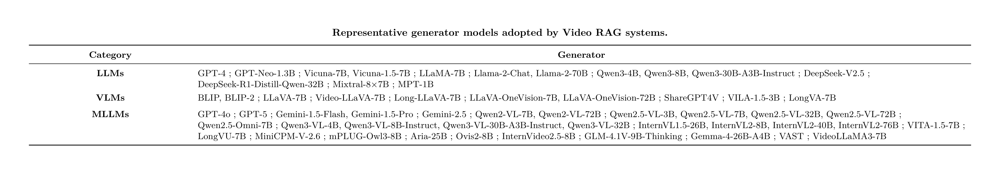

<h1 align="center">A Comprehensive Survey on Video Retrieval-Augmented Generation: A System-Oriented Perspective</h1>

<p align="center">
  
  
  
  
</p>


This repository accompanies **A Comprehensive Survey on Video Retrieval-Augmented Generation: A System-Oriented Perspective**. It presents a system-oriented overview of **video knowledge organization, evidence acquisition, and retrieval-augmented generation**, along with a curated collection of research papers and evaluation resources.

Video RAG makes large-scale and long-form video content searchable and supports responses grounded in retrieved **visual, textual, acoustic, temporal, and structured evidence**.

<a id="quick-index"></a>

## Quick Index

- [Workflow](#workflow)
- [What Counts as Video RAG?](#what-counts-as-video-rag)
- [Evolution](#evolution)
- [Taxonomy and Key Design Choices](#taxonomy-and-key-design-choices)
- [Video Knowledge Indexing and Representation](#video-knowledge-indexing-and-representation)
- [Retrieval Strategies and Mechanisms](#retrieval-strategies-and-mechanisms)
  - [Retrieval Granularity](#retrieval-granularity)
  - [Retrieval Mechanism](#retrieval-mechanism)
- [Retrieval Augmentation and Generation](#retrieval-augmentation-and-generation)
  - [Multimodal Fusion](#multimodal-fusion)
  - [Integration Paradigms of Video RAG Systems](#integration-paradigms-of-video-rag-systems)
- [Benchmarks and Datasets](#benchmarks-and-datasets)
- [Evaluation](#evaluation)
- [Paper Collection](#paper-collection)
- [Applications](#applications)
- [Challenges and Future Directions](#challenges-and-future-directions)
- [Contributing and Citation](#contributing-and-citation)

---

## Workflow

The survey organizes Video RAG systems into three connected stages:

1. **Video knowledge indexing and representation** — prepare video corpora, extract and align multimodal content, construct retrievable knowledge bases, and build indices.
2. **Retrieval strategies and mechanisms** — interpret queries, select the retrieval target and temporal granularity, retrieve relevant evidence, and filter or rerank the results.
3. **Retrieval augmentation and generation** — fuse evidence across modalities and generate responses supported by retrieved video content.

The workflow below maps these stages to their constituent modules and associated methods.

<p align="center">
  <a href="imgC/Fig10_Workflow.png"></a>
</p>


---

## What Counts as Video RAG?

In this survey, a system is counted as Video RAG when:

1. Video content is transformed into a **retrievable knowledge base** $\mathcal{K}$.
2. A retriever $\mathcal{R}$ selects query-relevant evidence $\mathcal{E}$ from $\mathcal{K}$.
3. A generator $\mathcal{G}$ produces a textual answer grounded in the query and retrieved evidence:

$$
r = \mathcal{G}\bigl(q,\mathcal{R}(q,\mathcal{K})\bigr).
$$

The evidence may consist of **frames, clips, scenes, full videos, transcripts, audio, timestamps, metadata, or graph-structured records**.

<p align="center">
  <a href="imgC/videorag-framework.png"></a>
</p>


**Scope.** Video RAG differs from direct Video QA and captioning in its **explicit evidence retrieval** step. It also differs from video moment retrieval and text-to-video retrieval, where the retrieved interval or ranked video list is usually the final output rather than context for answer generation.

<p align="center">
  <a href="imgC/task-comparison.png"></a>
</p>


---

## Evolution

Video RAG research has progressed from **external knowledge-assisted video description** to **video-grounded retrieval, multimodal memories, graph-based reasoning, adaptive retrieval, and streaming systems**. The timeline distinguishes **optimized retrieval strategies**, **internal knowledge bases**, and **external knowledge bases**; **†** denotes a RAG-adjacent method.

<p align="center">
  <a href="imgC/Evolution.png"></a>
</p>


---

## Taxonomy and Key Design Choices

Five design choices connect **organization, acquisition, and utilization**: index-unit granularity, knowledge structure, retrieval strategy, modality alignment, and generator integration. Together, they balance evidence coverage, retrieval effectiveness, context budget, and system cost.

<p align="center">
  <a href="imgC/key_design_choices.png"></a>
</p>


---

## Video Knowledge Indexing and Representation

Video knowledge organization determines **what can be retrieved**. It includes corpus construction, multimodal content extraction, knowledge-base construction, and hybrid indexing.

### Multimodal Content Extraction

Visual frames and scene descriptions, audio events and ASR, OCR and subtitles, and temporal metadata are extracted and aligned into retrievable evidence units. Frame sampling may be uniform, keyframe-based, or adaptive.

<p align="center">
  <a href="imgC/multimodal-content-extraction-alignment.png"></a>
</p>


---

## Retrieval Strategies and Mechanisms

Retrieval determines **which evidence is needed** for a query, **where to search**, and **how much evidence to return**. Typical operations include query rewriting, decomposition, modality-aware expansion, reranking, and temporal context expansion.

### Retrieval Granularity

The retrieval unit may be a **frame, clip, scene, video**, or an adaptive combination of levels. Finer units improve moment localization, while coarser units retain more contextual information.

<p align="center">
  <a href="imgC/multi_granular_retrieval.png"></a>
</p>


### Retrieval Mechanism

- **Single-step retrieval:** selects relevant evidence in one retrieval pass.
- **Multi-step retrieval:** iteratively refines or expands evidence across retrieval steps.
- **Adaptive retrieval:** chooses the retrieval configuration, depth, modalities, or stopping conditions according to the query and evidence state.

<p align="center">
  <a href="imgC/retrieval_strategies.png"></a>
</p>


---

## Retrieval Augmentation and Generation

After retrieval, evidence is aligned with the query, organized within the available context budget, and supplied to a generator to produce a **grounded response**.

### Multimodal Fusion

**Early fusion** combines evidence before the generator's main reasoning process; **mid fusion** integrates modalities through learned or intermediate representations; and **late fusion** consolidates outputs or evidence from multiple sources.

<p align="center">
  <a href="imgC/Table_Multimodal_Fusion.png"></a>
</p>


### Generator Models

Text-only LLMs can reason over textualized video records; LVLMs and MLLMs can incorporate retrieved visual evidence and additional modalities. Model selection affects context length, evidence format, computational cost, and grounding capabilities.

<p align="center">
  <a href="imgC/Table_Generator_Types_Systems.png"></a>
</p>


<details>
<summary><strong>Representative generative models</strong></summary>


<p align="center">
  <a href="imgC/Table_Generator_Models.png"></a>
</p>


</details>

### Integration Paradigms of Video RAG Systems

The survey distinguishes **training-enhanced integration** (including supervised and preference-based optimization) from **training-free integration**. Agentic workflows can orchestrate retrieval and generation within either setting.

<p align="center">
  <a href="imgC/Table_Integration_Paradigms.png"></a>
</p>


---

## Benchmarks and Datasets

The following table collects the benchmarks listed in Table 13 of the survey. The **Original paper** column links to the work that introduced or released each benchmark.

| Benchmark | Focus | Original paper | Benchmark / data |
| --- | --- | --- | --- |
| **MSVD** | Video captioning and video-text retrieval | [Paper](https://www.cs.utexas.edu/~ml/papers/captioning-acl11.pdf) | - |
| **MSR-VTT** | Video captioning and video-text retrieval | [Paper](https://arxiv.org/abs/1502.08029) | [Dataset / code](https://github.com/ArrowLuo/VideoCaptioning) |
| **VATEX** | Multilingual video captioning and retrieval | [Paper](https://arxiv.org/abs/1904.03400) | [Dataset](https://ericguo5513.github.io/vatex-website/) |
| **ActivityNet Captions** | Dense video captioning | [Paper](https://arxiv.org/abs/1705.00754) | [Dataset](https://cs.stanford.edu/people/ranjaykrishna/densevid/) |
| **YouCook2** | Instructional video captioning and retrieval | [Paper](https://arxiv.org/abs/1804.02348) | [Dataset](http://youcook2.eecs.umich.edu/) |
| **BDD-X** | Driving video explanations and captioning | [Paper](https://arxiv.org/abs/1806.09866) | [Dataset](https://github.com/xdshang/BDD-x-dataset) |
| **Spoken-SAX** | Spoken video description and retrieval | [Paper](https://scholar.google.com/scholar?q=Spoken-SAX) | - |
| **News Video Dataset** | News video captioning and retrieval | [Paper](https://arxiv.org/abs/1804.01735) | - |
| **WikiVideo** | Multi-video article generation | [Paper](https://scholar.google.com/scholar?q=WikiVideo+Article+generation+from+multiple+videos) | - |
| **MSVD-QA** | Open-ended video question answering | [Paper](https://arxiv.org/abs/1511.05938) | - |
| **MSRVTT-QA** | Open-ended video question answering | [Paper](https://arxiv.org/abs/1511.05938) | - |
| **TGIF-QA** | Video question answering over animated GIFs | [Paper](https://arxiv.org/abs/1704.04497) | [Dataset](https://github.com/YunseokJANG/tgif-qa) |
| **ActivityNet-QA** | Video question answering | [Paper](https://arxiv.org/abs/1906.02467) | [Dataset](https://github.com/MILVLG/activitynet-qa) |
| **TVQA** | Compositional question answering over TV episodes | [Paper](https://arxiv.org/abs/1809.01696) | [Dataset](https://tvqa.cs.unc.edu/) |
| **How2QA** | Instructional video question answering | [Paper](https://arxiv.org/abs/2006.15508) | - |
| **NExT-QA** | Causal and temporal video QA | [Paper](https://openaccess.thecvf.com/content/CVPR2021/html/Xiao_NExT-QA_Next_Phase_of_Question-Answering_to_Explaining_Temporal_Actions_CVPR_2021_paper.html) | [Dataset](https://github.com/doc-doc/NExT-QA) |
| **STAR** | Situated reasoning in real-world videos | [Paper](https://arxiv.org/abs/2210.13939) | - |
| **IntentQA** | Intent-oriented video question answering | [Paper](https://arxiv.org/abs/2207.04816) | - |
| **iVQA** | Open-ended video question answering | [Paper](https://arxiv.org/abs/2105.06994) | - |
| **MVBench** | Multi-task multimodal video understanding | [Paper](https://arxiv.org/abs/2311.17005) | [Dataset / code](https://github.com/OpenGVLab/Ask-Anything) |
| **EgoMCQ** | Egocentric video multiple-choice QA | [Paper](https://arxiv.org/abs/2205.12687) | - |
| **CFVBench** | Fine-grained video retrieval-augmented generation | [Paper](https://scholar.google.com/scholar?q=CFVBench) | - |
| **Video SimpleQA** | Factual video question answering | [Paper](https://scholar.google.com/scholar?q=Video+SimpleQA) | - |
| **ForeSeaQA** | Forensic video question answering | [Paper](https://scholar.google.com/scholar?q=ForeSeaQA) | - |
| **LSMDC** | Movie description retrieval | [Paper](https://arxiv.org/abs/1506.06981) | [Dataset](https://www.cc.gatech.edu/~dbatra/lsmdc/) |
| **DiDeMo** | Moment localization and text-video retrieval | [Paper](https://arxiv.org/abs/1708.01641) | [Dataset / code](https://github.com/LisaAnne/LocalizingMoments) |
| **EK100 MIR** | Egocentric video-text retrieval | [Paper](https://arxiv.org/abs/2207.01399) | [Dataset](https://epic-kitchens.github.io/2023) |
| **Charades-Ego** | Egocentric video understanding and retrieval | [Paper](https://arxiv.org/abs/1804.09626) | - |
| **EgoLearner** | Egocentric video retrieval | [Paper](https://scholar.google.com/scholar?q=EgoLearner+video+retrieval) | - |
| **Charades-STA** | Temporal sentence grounding | [Paper](https://arxiv.org/abs/1705.02101) | [Code](https://github.com/jiyanggao/TALL) |
| **QVHighlights** | Query-focused moment retrieval and highlight detection | [Paper](https://arxiv.org/abs/2107.09609) | [Dataset / code](https://github.com/jayleicn/moment_detr) |
| **Ego4D** | Egocentric video understanding and temporal grounding | [Paper](https://arxiv.org/abs/2110.04963) | [Dataset](https://ego4d-data.org/) |
| **MovieQA** | Movie story question answering | [Paper](https://arxiv.org/abs/1511.02912) | [Dataset](http://movieqa.cs.toronto.edu/) |
| **MovieChat-1K** | Long movie question answering | [Paper](https://arxiv.org/abs/2307.16449) | [Code](https://github.com/rese1f/MovieChat) |
| **TVQA-Long** | Episode-length TV video QA | [Paper](https://arxiv.org/abs/2407.12679) | [Project](https://vision-cair.github.io/Goldfish_website/) |
| **EgoSchema** | Very long-form egocentric video QA | [Paper](https://proceedings.neurips.cc/paper_files/paper/2023/hash/90ce332aff156b910b002ce4e6880dec-Abstract-Datasets_and_Benchmarks.html) | [Dataset](https://github.com/egoschema/EgoSchema) |
| **LVU** | Long video understanding | [Paper](https://arxiv.org/abs/2110.06186) | - |
| **LongVideoBench** | Long-context interleaved video-language reasoning | [Paper](https://arxiv.org/abs/2407.15754) | [Dataset / code](https://github.com/longvideobench/LongVideoBench) |
| **MLVU** | Multi-task long-video understanding | [Paper](https://openaccess.thecvf.com/content/CVPR2025/html/Zhou_MLVU_Benchmarking_Multi-task_Long_Video_Understanding_CVPR_2025_paper.html) | [Dataset / code](https://github.com/JUNJIE99/MLVU) |
| **LVBench** | Extreme long-video understanding | [Paper](https://openaccess.thecvf.com/content/ICCV2025/html/Wang_LVBench_An_Extreme_Long_Video_Understanding_Benchmark_ICCV_2025_paper.html) | [Dataset / code](https://github.com/zai-org/LVBench) |
| **VNBench** | Needle-in-a-haystack long-video understanding | [Paper](https://scholar.google.com/scholar?q=VNBench+long+video) | - |
| **Video-MME** | Multimodal video understanding across durations | [Paper](https://openaccess.thecvf.com/content/CVPR2025/html/Fu_Video-MME_The_First-Ever_Comprehensive_Evaluation_Benchmark_of_Multi-modal_LLMs_in_CVPR_2025_paper.html) | [Dataset / code](https://github.com/MME-Benchmarks/Video-MME) |
| **Video-MMMU** | Multimodal video reasoning | [Paper](https://scholar.google.com/scholar?q=Video-MMMU) | - |
| **MMBench-Video** | Long-form multi-shot video understanding | [Paper](https://arxiv.org/abs/2406.14559) | - |
| **MMR-V** | Multimodal deep reasoning in videos | [Paper](https://arxiv.org/abs/2502.10397) | - |
| **Video-Holmes** | Long-video reasoning and knowledge understanding | [Paper](https://scholar.google.com/scholar?q=Video-Holmes) | - |
| **VSI-Bench** | Visual-spatial reasoning in videos | [Paper](https://arxiv.org/abs/2410.11619) | - |
| **HiVU** | Hierarchical video understanding | [Paper](https://proceedings.neurips.cc/paper_files/paper/2025/hash/092359ce5cf60a80e882378944bf1be4-Abstract-Conference.html) | [Project](https://github.com/xzc-zju/AdaVideoRAG) |
| **LongerVideos** | Cross-video and extremely long-context QA | [Paper](https://arxiv.org/abs/2502.01549) | [Dataset / code](https://github.com/HKUDS/VideoRAG) |
| **EgoLifeQA** | Lifelong egocentric video QA | [Paper](https://scholar.google.com/scholar?q=EgoLifeQA) | - |
| **Ego-R1** | Long-horizon egocentric video reasoning | [Paper](https://scholar.google.com/scholar?q=Ego-R1+video) | - |
| **HippoVlog** | Long-form egocentric vlog understanding | [Paper](https://scholar.google.com/scholar?q=HippoVlog) | - |
| **CinePile** | Long-video question answering | [Paper](https://arxiv.org/abs/2405.08813) | - |
| **ScaleLong** | Multi-timescale long-video understanding | [Paper](https://scholar.google.com/scholar?q=ScaleLong+video) | - |
| **Event-Bench** | Event-centric video understanding | [Paper](https://scholar.google.com/scholar?q=Event-Bench+video+understanding) | - |
| **CG-Bench** | Clue-grounded long-video QA | [Paper](https://arxiv.org/abs/2505.17673) | - |
| **EC-Bench** | Long-video event comprehension | [Paper](https://scholar.google.com/scholar?q=EC-Bench+video) | - |
| **MM-Lifelong** | Lifelong multimodal video understanding | [Paper](https://scholar.google.com/scholar?q=MM-Lifelong+video) | - |
| **TempCompass** | Temporal video understanding | [Paper](https://arxiv.org/abs/2403.00476) | [Dataset / code](https://github.com/llyx97/TempCompass) |
| **VRBench** | Multi-step reasoning in long narrative videos | [Paper](https://arxiv.org/abs/2505.10572) | - |
| **LongVidSearch** | Multi-hop evidence retrieval planning | [Paper](https://arxiv.org/abs/2603.14468) | [Dataset](https://huggingface.co/datasets/Fishiing/LongVidSearch) |
| **OVO-Bench** | Streaming video understanding | [Paper](https://arxiv.org/abs/2505.09711) | - |
| **StreamingBench** | Real-time streaming video understanding | [Paper](https://scholar.google.com/scholar?q=StreamingBench+video+understanding) | - |


## Evaluation

Answer accuracy alone does not identify whether a Video RAG system has retrieved the right evidence, localized the correct moment, or generated a well-supported answer. Evaluation should jointly assess **retrieval, grounding, generation, robustness, and efficiency**.

<p align="center">
  <a href="imgC/Fig9_Evaluation.png"></a>
</p>


| Dimension                 | Representative metrics / protocols                           |
| ------------------------- | ------------------------------------------------------------ |
| **Evidence retrieval**    | Recall@K, Precision@K, F1@K, Hit Rate, mAP, nDCG, MRR, MedR, MnR |
| **Temporal grounding**    | tIoU, mIoU, IoU-thresholded Recall@K, MTGS                   |
| **Citation attribution**  | CiteP, CiteR, CiteF1; support of generated claims by cited video evidence |
| **Answer generation**     | Accuracy, Exact Match, F1, ANLS, BLEU, METEOR, ROUGE, CIDEr, BERTScore, STEM, InfoP, InfoR, InfoF1, LLM-as-a-judge |
| **Long-video robustness** | Length-stratified accuracy, performance over increasing video duration |
| **Cross-video reasoning** | Long-range and multi-video reasoning scores; evidence coverage across events and sources |
| **System efficiency**     | Retrieval and end-to-end latency, wall-clock time, memory, TFLOPs, processed frames and tokens |

For reproducibility, report the **video duration**, **frame-sampling budget**, **retrieved evidence count and granularity**, **used modalities**, **indexing cost**, **generator**, and **inference settings** alongside answer metrics.

---

## Paper Collection

Video RAG and retrieval-based video methods are listed chronologically. **†** denotes a RAG-adjacent method.

### Video RAG Systems and Methods

| Year | Paper                                                        | Venue / source                       |                         Code                          |
| :--: | ------------------------------------------------------------ | ------------------------------------ | :---------------------------------------------------: |
| 2018 | [**Know-Aware VD** — Incorporating background knowledge into video description generation](https://aclanthology.org/D18-1433/) | EMNLP 2018                           |                           —                           |
| 2023 | [**R-ConvED** — Retrieval augmented convolutional encoder-decoder networks for video captioning](https://doi.org/10.1145/3539225) | ACM TOMM 2023                        |                           —                           |
| 2023 | [**R2A** — Retrieving-to-answer: Zero-shot video question answering with frozen large language models](https://openaccess.thecvf.com/content/ICCV2023W/MMFM/html/Pan_Retrieving-to-Answer_Zero-Shot_Video_Question_Answering_with_Frozen_Large_Language_Models_ICCVW_2023_paper.html) | ICCVW 2023                           |                           —                           |
| 2023 | [**ChatVideo**: A tracklet-centric multimodal and versatile video understanding system](https://arxiv.org/abs/2304.14407) | arXiv 2023                           |    [Code](https://github.com/yiwengxie/Chat-Video)    |
| 2023 | [**SeViLA** — Self-chained image-language model for video localization and question answering](https://proceedings.neurips.cc/paper_files/paper/2023/hash/f22a9af8dbb348952b08bd58d4734b50-Abstract-Conference.html) | NeurIPS 2023                         |      [Code](https://github.com/Yui010206/SeViLA)      |
| 2024 | [**iRAG**: Advancing rag for videos with an incremental approach](https://doi.org/10.1145/3627673.3680088) | CIKM 2024                            |                           —                           |
| 2024 | [**ViTA**: An efficient video-to-text algorithm using vlm for rag-based video analysis system](https://openaccess.thecvf.com/content/CVPR2024W/MAR/html/Arefeen_ViTA_An_Efficient_Video-to-Text_Algorithm__using_VLM_for_RAG-based_CVPRW_2024_paper.html) | CVPRW 2024                           |                           —                           |
| 2024 | [**Goldfish**: Vision-language understanding of arbitrarily long videos](https://www.ecva.net/papers/eccv_2024/papers_ECCV/html/4213_ECCV_2024_paper.php) | ECCV 2024                            | [Code](https://github.com/Vision-CAIR/MiniGPT4-video) |
| 2024 | [**RAG-Indoor** — Retrieval-augmented-generation-enhanced Dense Video Caption for Human Indoor Activities: Disambiguating Caption Using Spatial Information Beyond Field of View Constraints](https://scholar.google.com/scholar?q=Retrieval-augmented-generation-enhanced%20Dense%20Video%20Caption%20for%20Human%20Indoor%20Activities%3A%20Disambiguating%20Caption%20Using%20Spatial%20Information%20Beyond%20Field%20of%20View%20Constraints) | Sensors & Materials 2024             |                           —                           |
| 2024 | [**VideoAgent**: A memory-augmented multimodal agent for video understanding](https://www.ecva.net/papers/eccv_2024/papers_ECCV/html/3241_ECCV_2024_paper.php) | ECCV 2024                            |   [Code](https://github.com/YueFan1014/VideoAgent)    |
| 2024 | [**MA-LMM†**: Memory-augmented large multimodal model for long-term video understanding](https://openaccess.thecvf.com/content/CVPR2024/html/He_MA-LMM_Memory-Augmented_Large_Multimodal_Model_for_Long-Term_Video_Understanding_CVPR_2024_paper.html) | CVPR 2024                            |       [Code](https://github.com/boheumd/MA-LMM)       |
| 2024 | [**Enhance-RAG†** — Enhancing Video Retrieval via Synergized Image Embeddings and RAG](https://scholar.google.com/scholar?q=Enhancing%20Video%20Retrieval%20via%20Synergized%20Image%20Embeddings%20and%20RAG) | 2024 (ISI)                           |                           —                           |
| 2024 | [**EgoInstructor** — Retrieval-augmented egocentric video captioning](https://openaccess.thecvf.com/content/CVPR2024/html/Xu_Retrieval-Augmented_Egocentric_Video_Captioning_CVPR_2024_paper.html) | CVPR 2024                            | [Code](https://github.com/Jazzcharles/Egoinstructor)  |
| 2024 | [**RAG-Driver**: Generalisable driving explanations with retrieval-augmented in-context learning in multi-modal large language model](https://arxiv.org/abs/2402.10828) | arXiv 2024                           |                           —                           |
| 2025 | [**TV-RAG**: A temporal-aware and semantic entropy-weighted framework for long video retrieval and understanding](https://doi.org/10.1145/3746027.3755873) | ACM MM 2025                          | [Code](https://github.com/AI-Researcher-Team/TV-RAG)  |
| 2025 | [**OneClip-RAG** — Towards Effective Long Video Understanding of Multimodal Large Language Models via One-shot Clip Retrieval](https://arxiv.org/abs/2512.08410) | arXiv 2025                           |                           —                           |
| 2025 | [**RAPO** — The devil is in the prompts: Retrieval-augmented prompt optimization for text-to-video generation](https://scholar.google.com/scholar?q=The%20devil%20is%20in%20the%20prompts%3A%20Retrieval-augmented%20prompt%20optimization%20for%20text-to-video%20generation) | CVPR 2025                            |                           —                           |
| 2025 | [**VRAG**: Retrieval-augmented video question answering for long-form videos](https://scholar.google.com/scholar?q=Vrag%3A%20Retrieval-augmented%20video%20question%20answering%20for%20long-form%20videos) | CVPR 2025                            |                           —                           |
| 2025 | [**FRAG**: Frame selection augmented generation for long video and long document understanding](https://arxiv.org/abs/2504.17447) | arXiv 2025                           |        [Code](https://github.com/NVlabs/FRAG)         |
| 2025 | [**VideoRAG (KAIST)** — Videorag: Retrieval-augmented generation over video corpus](https://aclanthology.org/2025.findings-acl.1096/) | Findings ACL 2025                    |     [Code](https://github.com/starsuzi/VideoRAG)      |
| 2025 | [**Video Swagger** — Social Media Video Creation: Harnessing the Power of Large Language Models for Non-Linear Editing and RAG-Based Question-Answering](https://scholar.google.com/scholar?q=Social%20Media%20Video%20Creation%3A%20Harnessing%20the%20Power%20of%20Large%20Language%20Models%20for%20Non-Linear%20Editing%20and%20RAG-Based%20Question-Answering) | ICCTDC 2025                          |                           —                           |
| 2025 | [**SALOVA**: Segment-augmented long video assistant for targeted retrieval and routing in long-form video analysis](https://openaccess.thecvf.com/content/CVPR2025/html/Kim_SALOVA_Segment-Augmented_Long_Video_Assistant_for_Targeted_Retrieval_and_Routing_CVPR_2025_paper.html) | CVPR 2025                            |      [Code](https://github.com/IVY-LVLM/SALOVA)       |
| 2025 | [**CadenceRAG**: Context-aware and dependency-enhanced retrieval augmented generation for holistic video understanding](https://scholar.google.com/scholar?q=Cadencerag%3A%20Context-aware%20and%20dependency-enhanced%20retrieval%20augmented%20generation%20for%20holistic%20video%20understanding) | CVPR 2025                            |                           —                           |
| 2025 | [**DrVideo**: Document retrieval based long video understanding](https://openaccess.thecvf.com/content/CVPR2025/html/Ma_DrVideo_Document_Retrieval_Based_Long_Video_Understanding_CVPR_2025_paper.html) | CVPR 2025                            |     [Code](https://github.com/Upper9527/DrVideo)      |
| 2025 | [**X-CoT†**: Explainable text-to-video retrieval via llm-based chain-of-thought reasoning](https://scholar.google.com/scholar?q=X-cot%3A%20Explainable%20text-to-video%20retrieval%20via%20llm-based%20chain-of-thought%20reasoning) | EMNLP 2025                           |                           —                           |
| 2025 | [**FilterRAG**: zero-shot informed retrieval-augmented generation to mitigate hallucinations in VQA](https://arxiv.org/abs/2502.18536) | arXiv 2025                           |                           —                           |
| 2025 | [**LightVideoRAG**: Low-Resource Long Video Question-Answering via Adaptive Sampling and Context-Aware Retrieval](https://scholar.google.com/scholar?q=LightVideoRAG%3A%20Low-Resource%20Long%20Video%20Question-Answering%20via%20Adaptive%20Sampling%20and%20Context-Aware%20Retrieval) | 2025 (AMCMI)                         |                           —                           |
| 2025 | [**VideoTree**: Adaptive tree-based video representation for llm reasoning on long videos](https://openaccess.thecvf.com/content/CVPR2025/html/Wang_VideoTree_Adaptive_Tree-based_Video_Representation_for_LLM_Reasoning_on_Long_CVPR_2025_paper.html) | CVPR 2025                            |    [Code](https://github.com/Ziyang412/VideoTree)     |
| 2025 | [**E-VRAG**: Enhancing long video understanding with resource-efficient retrieval augmented generation](https://arxiv.org/abs/2508.01546) | arXiv 2025                           |                           —                           |
| 2025 | [**MemVid** — Memory-enhanced retrieval augmentation for long video understanding](https://arxiv.org/abs/2503.09149) | arXiv 2025                           |                           —                           |
| 2025 | [**VideoExplorer**: Think with videos for agentic long-video understanding](https://arxiv.org/abs/2506.10821) | arXiv 2025                           |                           —                           |
| 2026 | [**VideoRAG (VIT)†** — Scalable Multilingual Retrieval of Lecture Moments Through Whisper-Based Transcripts and Vector Search](https://scholar.google.com/scholar?q=Scalable%20Multilingual%20Retrieval%20of%20Lecture%20Moments%20Through%20Whisper-Based%20Transcripts%20and%20Vector%20Search) | IEEE Access 2026                     |                           —                           |
| 2026 | [**QualiRAG**: Retrieval-augmented generation for visual quality understanding](https://arxiv.org/abs/2601.18195) | arXiv 2026                           |                           —                           |
| 2026 | [**ViG-RAG**: Video-aware Graph Retrieval-Augmented Generation via Temporal and Semantic Hybrid Reasoning](https://doi.org/10.1609/aaai.v40i1.36963) | AAAI 2026                            | [Code](https://github.com/AI-Researcher-Team/ViG-RAG) |
| 2026 | [**MARQUIS**: A three-stage pipeline for video retrieval-augmented generation](https://scholar.google.com/scholar?q=Marquis%3A%20A%20three-stage%20pipeline%20for%20video%20retrieval-augmented%20generation) | MAGMaR 2026                          |                           —                           |
| 2026 | [**Event-Anchored** frame selection for effective long-video understanding](https://arxiv.org/abs/2603.00983) | arXiv 2026                           |                           —                           |
| 2026 | [**Sprout**: Building Dynamic Memory While Reasoning for Agentic Video Understanding](https://arxiv.org/abs/2609.35497) | arXiv 2026                           |                           —                           |
| 2026 | [**VideoChat-M1**: Collaborative policy planning for video understanding via multi-agent reinforcement learning](https://scholar.google.com/scholar?q=Videochat-m1%3A%20Collaborative%20policy%20planning%20for%20video%20understanding%20via%20multi-agent%20reinforcement%20learning) | CVPR 2026                            |                           —                           |
| 2026 | [**MERIT** — Keep it simple: Multi-key episodic memory retrieval for ultra-long video understanding](https://scholar.google.com/scholar?q=Keep%20it%20simple%3A%20Multi-key%20episodic%20memory%20retrieval%20for%20ultra-long%20video%20understanding) | ECCV 2026                            |                           —                           |
| 2026 | [**Magnet**: A multi-agent framework for finding audio-visual needles by reasoning over multi-video haystacks](https://scholar.google.com/scholar?q=Magnet%3A%20A%20multi-agent%20framework%20for%20finding%20audio-visual%20needles%20by%20reasoning%20over%20multi-video%20haystacks) | NeurIPS 2026                         |                           —                           |
| 2026 | [**C2F-RAG** — Decoupling semantics and logic: A training-free coarse-to-fine pipeline for video retrieval-augmented generation](https://scholar.google.com/scholar?q=Decoupling%20semantics%20and%20logic%3A%20A%20training-free%20coarse-to-fine%20pipeline%20for%20video%20retrieval-augmented%20generation) | MAGMaR 2026                          |                           —                           |
| 2026 | [**VideoStir**: Understanding long videos via spatio-temporally structured and intent-aware rag](https://aclanthology.org/2026.acl-long.1656/) | ACL 2026                             |      [Code](https://github.com/RomGai/VideoStir)      |
| 2026 | [**MAVIS** — Multi-Agent Video Intelligent System for Educational and Archival Video Analysis](https://scholar.google.com/scholar?q=Multi-Agent%20Video%20Intelligent%20System%20for%20Educational%20and%20Archival%20Video%20Analysis) | ICIPCN 2026                          |                           —                           |
| 2026 | [**VideoRAG (ZJU)** — Rewind-Augmented Generation for Long Video Understanding](https://scholar.google.com/scholar?q=Rewind-Augmented%20Generation%20for%20Long%20Video%20Understanding) | IEEE Transactions on Multimedia 2026 |                           —                           |
| 2026 | [**DAGC** — Coarse Indexing, Fine Evidence: Decoupling Temporal Granularity in Long-Video RAG](https://arxiv.org/abs/2608.23011) | arXiv 2026                           |                           —                           |
| 2026 | [**NR-MV-RAG** — Noise-Resilient Multimodal Video RAG Enhancing Urdu Retrieval](https://scholar.google.com/scholar?q=Noise-Resilient%20Multimodal%20Video%20RAG%20Enhancing%20Urdu%20Retrieval) | iCoMET 2026                          |                           —                           |
| 2026 | [**TrafficRAG**: Temporal Grounding for Traffic Violations via Retrieval-Augmented Generation](https://scholar.google.com/scholar?q=TrafficRAG%3A%20Temporal%20Grounding%20for%20Traffic%20Violations%20via%20Retrieval-Augmented%20Generation) | WACV 2026                            |                           —                           |
| 2026 | [**ReFoCUS**: Reinforcement-guided frame optimization for contextual understanding](https://scholar.google.com/scholar?q=Refocus%3A%20Reinforcement-guided%20frame%20optimization%20for%20contextual%20understanding) | CVPR 2026                            |                           —                           |
| 2026 | [**FastV-RAG**: Towards Fast and Fine-Grained Video QA with Retrieval-Augmented Generation](https://scholar.google.com/scholar?q=FastV-RAG%3A%20Towards%20Fast%20and%20Fine-Grained%20Video%20QA%20with%20Retrieval-Augmented%20Generation) | ACL 2026                             |                           —                           |
| 2026 | [**OASIS**: On-Demand Hierarchical Event Memory for Streaming Video Reasoning](https://arxiv.org/abs/2604.17052) | arXiv 2026                           |                           —                           |
| 2026 | [**Video-RAG**: Visually-aligned retrieval-augmented long video comprehension](https://papers.nips.cc/paper_files/paper/2025/hash/f593c9c251d4d7cf14d4ab9861dfb7eb-Abstract-Conference.html) | NeurIPS 2025                         | [Code](https://github.com/Leon1207/Video-RAG-master)  |
| 2026 | [**RAVU**: Retrieval augmented video understanding with compositional reasoning over graph](https://openaccess.thecvf.com/content/WACV2026/html/Malik_RAVU_Retrieval_Augmented_Video_Understanding_with_Compositional_Reasoning_over_Graph_WACV_2026_paper.html) | WACV 2026                            |                           —                           |
| 2026 | [**Multi-RAG**: A multimodal retrieval-augmented generation system for adaptive video understanding](https://scholar.google.com/scholar?q=Multi-rag%3A%20A%20multimodal%20retrieval-augmented%20generation%20system%20for%20adaptive%20video%20understanding) | PAKDD 2025                           |                           —                           |
| 2026 | [**WikiVideo**: Article generation from multiple videos](https://scholar.google.com/scholar?q=Wikivideo%3A%20Article%20generation%20from%20multiple%20videos) | Findings ACL 2026                    |                           —                           |
| 2026 | [**ForeSea**: AI forensic search with multi-modal queries for video surveillance](https://scholar.google.com/scholar?q=ForeSea%3A%20AI%20forensic%20search%20with%20multi-modal%20queries%20for%20video%20surveillance) | ECCV 2026                            |                           —                           |
| 2026 | [**UrbanClipAtlas**: A Visual Analytics Framework for Event and Scene Retrieval in Urban Videos](https://scholar.google.com/scholar?q=UrbanClipAtlas%3A%20A%20Visual%20Analytics%20Framework%20for%20Event%20and%20Scene%20Retrieval%20in%20Urban%20Videos) | Computer Graphics Forum              |                           —                           |
| 2026 | [**EGAgent** — Agentic very long video understanding](https://scholar.google.com/scholar?q=Agentic%20very%20long%20video%20understanding) | ACL 2026                             |                           —                           |
| 2026 | [**GEB** — Beyond the Timeline: Augmenting Long-Video Memory with Grounded Entity Biographies](https://arxiv.org/abs/2609.38155) | arXiv 2026                           |                           —                           |
| 2026 | [**VideoRAG (HKU)** — Videorag: Retrieval-augmented generation with extreme long-context videos](https://doi.org/10.1145/3770854.3783944) | KDD 2026                             |       [Code](https://github.com/HKUDS/VideoRAG)       |
| 2026 | [**Vgent**: Graph-based retrieval-reasoning-augmented generation for long video understanding](https://proceedings.neurips.cc/paper_files/paper/2025/hash/91b75715a2ae8f2542b78be31941eac3-Abstract-Conference.html) | NeurIPS 2025                         |    [Code](https://github.com/xiaoqian-shen/Vgent)     |
| 2026 | [**StreamRAG**: Enhancing Real-Time Video Understanding with Retrieval Augmentation](https://openaccess.thecvf.com/content/CVPR2026/html/Xie_StreamRAG_Enhancing_Real-Time_Video_Understanding_with_Retrieval_Augmentation_CVPR_2026_paper.html) | CVPR 2026                            |                           —                           |
| 2026 | [**R-VLM** — Long video understanding with learnable retrieval in video-language models](https://scholar.google.com/scholar?q=Long%20video%20understanding%20with%20learnable%20retrieval%20in%20video-language%20models) | IEEE Transactions on Multimedia 2026 |                           —                           |
| 2026 | [**VimoRAG**: Video-based retrieval-augmented 3d motion generation for motion language models](https://scholar.google.com/scholar?q=Vimorag%3A%20Video-based%20retrieval-augmented%203d%20motion%20generation%20for%20motion%20language%20models) | NeurIPS 2026                         |                           —                           |
| 2026 | [**AVA**: Towards Agentic Video Analytics with Vision Language Models](https://scholar.google.com/scholar?q=AVA%3A%20Towards%20Agentic%20Video%20Analytics%20with%20Vision%20Language%20Models) | USENIX NSDI 2026                     |                           —                           |
| 2026 | [**Event-Causal RAG**: A Retrieval-Augmented Generation Framework for Long Video Reasoning in Complex Scenarios](https://arxiv.org/abs/2605.06185) | arXiv 2026                           |                           —                           |
| 2026 | [**REVEAL**: A Rubric-Guided Agent for Explicit Evidence Sufficiency Verificationin Long-Video Question Answering](https://arxiv.org/abs/2608.08612) | arXiv 2026                           |                           —                           |
| 2026 | [**TRACE**: Evidence Grounding-Guided Multi-Video Event Understanding and Claim Generation](https://scholar.google.com/scholar?q=TRACE%3A%20Evidence%20Grounding-Guided%20Multi-Video%20Event%20Understanding%20and%20Claim%20Generation) | MAGMaR 2026                          |                           —                           |
| 2026 | [**Graph-to-Frame RAG**: Visual-Space Knowledge Fusion for Training-Free and Auditable Video Reasoning](https://arxiv.org/abs/2604.04372) | arXiv 2026                           |                           —                           |
| 2026 | [**WorldMM**: Dynamic multimodal memory agent for long video reasoning](https://openaccess.thecvf.com/content/CVPR2026/html/Yeo_WorldMM_Dynamic_Multimodal_Memory_Agent_for_Long_Video_Reasoning_CVPR_2026_paper.html) | CVPR 2026                            |       [Code](https://github.com/wgcyeo/WorldMM)       |
| 2026 | [**HAVEN** — Hierarchical Long Video Understanding with Audiovisual Entity Cohesion and Agentic Search](https://arxiv.org/abs/2601.13719) | arXiv 2026                           |                           —                           |
| 2026 | [**VideoARM**: Agentic reasoning over hierarchical memory for long-form video understanding](https://scholar.google.com/scholar?q=Videoarm%3A%20Agentic%20reasoning%20over%20hierarchical%20memory%20for%20long-form%20video%20understanding) | CVPR 2026                            |                           —                           |
| 2026 | [**SceneRAG**: Scene-level retrieval-augmented generation for video understanding](https://arxiv.org/abs/2506.07600) | ICASSP 2026                          |                           —                           |
| 2026 | [**AdaVideoRAG**: Omni-Contextual Adaptive Retrieval-Augmented Efficient Long Video Understanding](https://proceedings.neurips.cc/paper_files/paper/2025/hash/092359ce5cf60a80e882378944bf1be4-Abstract-Conference.html) | NeurIPS 2025                         |    [Code](https://github.com/xzc-zju/AdaVideoRAG)     |
| 2026 | [**SafeScreen**: A Safety-First Screening Framework for Personalized Video Retrieval for Vulnerable Users](https://arxiv.org/abs/2604.03264) | arXiv 2026                           |                           —                           |
|  —   | [**VideoTrace-R1**: Long Video-based Retrieval-Augmented Generation via Reinforcement Learning](https://scholar.google.com/scholar?q=VideoTrace-R1%3A%20Long%20Video-based%20Retrieval-Augmented%20Generation%20via%20Reinforcement%20Learning) | ICML (year absent in BibTeX)         |                           —                           |


---

## Applications

The survey discusses Video RAG in several domains:

- **Education and knowledge learning:** lecture search, instructional QA, and personalized review.
- **Film and entertainment:** story understanding, event and character retrieval, and episode navigation.
- **Surveillance and public safety:** long-duration event search, anomaly investigation, and forensic review.
- **Embodied AI and robotics:** episodic memory, action and navigation history, and task planning.
- **Healthcare:** surgical video retrieval, monitoring, and case-grounded assistance.
- **Content creation:** source localization, news/video production, and retrieval-guided editing.
- **Enterprise and scientific workflows:** procedural knowledge retrieval, experimental videos, and searchable multimodal records.

## Challenges and Future Directions

1. **Hierarchical and long-term memory:** maintain entities, events, temporal dependencies, and source provenance across lengthy videos.
2. **Fine-grained, multimodal retrieval:** locate sparse or distributed evidence without discarding the context required for reasoning.
3. **Adaptive and agentic acquisition:** select modalities, granularities, tools, and retrieval stopping conditions dynamically.
4. **Efficient and deployable systems:** reduce indexing, storage, retrieval, and inference costs for streaming and real-time settings.
5. **Evidence-grounded generation:** improve cross-modal alignment, factual consistency, and traceable citation of retrieved moments.
6. **Unified evaluation:** jointly assess retrieval, localization, reasoning, answer quality, robustness, and computational cost.

---

## Contributing and Citation

We welcome additions of Video RAG papers, corrected publication or code links, new datasets and benchmarks, and feedback on taxonomy or evaluation coverage. Please open an issue or pull request with the paper **title, authors, venue/year, paper URL, official code/project URL (if available), and a short contribution summary**.

The final publication details will be added when available.

```bibtex
@misc{videorag_survey_2026,
  title = {A Comprehensive Survey on Video Retrieval-Augmented Generation: A System-Oriented Perspective},
  year  = {2026},
  note  = {Survey manuscript}
}
```
